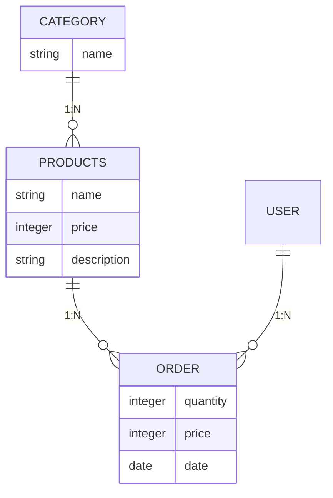

# FITNESS_PROJECT
Сайт для магазина спортинвентаря


## 🚀 Запуск проекта  

### Вариант 1: через Docker (рекомендуется)

1. Клонируйте проект с GitHub:
   ```bash
   git clone <ссылка_на_ваш_репозиторий>
   cd <папка_проекта>
   ```
2. Убедитесь, что установлен Docker (Docker Desktop):
   ```bash
   docker --version
   ```
3. Запустите проект одной командой:
   ```bash
   make docker-up
   ```
   или напрямую через Docker Compose:
   ```bash
   docker-compose up --build
   ```
4. После запуска сервисы будут доступны по адресам:
   - Django-приложение: http://localhost:8000
   - Grafana: http://localhost:3000 (логин/пароль: admin/admin)
   - Prometheus: http://localhost:9090

5. Остановить все сервисы:
   ```bash
   make docker-down
   ```
   или
   ```bash
   docker-compose down
   ```

**Всё, что нужно для запуска — это Docker и одна команда!**

---

### Как это работает (простое объяснение)

- Docker автоматически собирает и запускает все нужные сервисы: Django, базу данных, Prometheus, Grafana и т.д.
- Django-приложение отдаёт специальные метрики по адресу `/metrics`.
- Prometheus собирает эти метрики и хранит у себя.
- Grafana показывает их в виде красивых графиков.
- Благодаря этому вы можете видеть, как работает приложение, сколько пользователей, сколько ошибок, как быстро отвечает сайт и т.д.

---

### Вариант 2: вручную (без Docker)
1. Установите зависимости:  
   ```bash
   pip install -r requirements.txt
   ```
2. Запустить сервер:
   ```bash
   python manage.py runserver
   ```
3. Как запустить миграции:
    ```
    python manage.py migrate
    ```

## 📂 Структура проекта
### Какие приложения есть:
```bash
    fitness_project             # Проект
    ├───fitness_project         # Стандартное приложение с настройками Django
    ├───static                  # Статические файлы
    │   ├───css                 
    │   └───img
    │       └───sorting_catalog
    ├───store                   # Приложение для самого магазина
    │   ├───migrations          # Миграции для магазина
    │   └───templates           # Шаблоны для магазина
    │       └───store
    ├───templates               # Общие шаблоны проекта
    └───users                   # Приложения для работы с пользователями (регистрация/авторизация)
        ├───migrations          # Мигрции для пользователей
        └───templates           # Шаблоны для работы с пользователями
            └───users
```
### Какие модели есть:
#### 🗂 Модель `Category`

**Назначение**: Категории товаров интернет-магазина с поддержкой перевода названий.

###### Поля
| Поле       | Тип          | Описание                          |
|------------|--------------|-----------------------------------|
| `name`     | `CharField`  | Название категории (до 50 символов). |

###### Методы
```python
@staticmethod
get_all_categories() -> QuerySet[Category]
```
**Возвращает**: Все категории из БД.

```python
get_translated_name() -> str
```
**Возвращает**: Перевод названия категории на русский (если есть в `en_rus_catalog`).

###### Пример использования
```python
# Получить все категории
categories = Category.get_all_categories()

# Получить русское название
category = Category.objects.get(name="velosport")
print(category.get_translated_name())  # "Велоспорт"
```

---

#### 🛍 Модель `Products`

**Назначение**: Товары интернет-магазина.

###### Поля
| Поле            | Тип                | Описание                          |
|-----------------|--------------------|-----------------------------------|
| `name`          | `CharField`        | Название товара (до 60 символов). |
| `price`         | `IntegerField`     | Цена в рублях.                    |
| `category`      | `ForeignKey`       | Связь с категорией.               |
| `description`   | `CharField`        | Описание товара (до 250 символов).|
| `company_name`  | `CharField`        | Производитель (по умолчанию "GOD").|
| `rating`        | `IntegerField`     | Рейтинг от 0 до 5.                |
| `image`         | `URLField`         | Ссылка на изображение.            |

###### Методы
```python
@staticmethod
get_products_by_id(ids: list[int]) -> QuerySet[Products]
```
**Возвращает**: Товары с указанными ID.

```python
@staticmethod
get_all_products() -> QuerySet[Products]
```
**Возвращает**: Все товары из БД.

```python
@staticmethod
get_all_products_by_categoryname(category_name: str) -> QuerySet[Products]
```
**Возвращает**: Товары указанной категории (или все, если категория не найдена).

```python
@staticmethod
get_recommended_products(max_count: int = 4) -> QuerySet[Products]
```
**Возвращает**: Случайные товары (до `max_count` штук).

```python
@staticmethod
get_products_page(page_number: int, page_size: int, sort_command: str = None) -> QuerySet[Products]
```
**Возвращает**: Товары для пагинации с возможностью сортировки по категории.

###### Пример использования
```python
# Получить товары категории "Велоспорт"
products = Products.get_all_products_by_categoryname("velosport")

# Получить рекомендуемые товары
recommended = Products.get_recommended_products(3)
```

---

#### 📦 Модель `Order`

**Назначение**: Заказы пользователей.

###### Поля
| Поле       | Тип            | Описание                          |
|------------|----------------|-----------------------------------|
| `product`  | `ForeignKey`   | Связь с товаром.                  |
| `user`     | `ForeignKey`   | Связь с пользователем.            |
| `quantity` | `IntegerField` | Количество товаров.               |
| `price`    | `IntegerField` | Общая стоимость заказа.           |
| `address`  | `CharField`    | Адрес доставки.                   |
| `phone`    | `CharField`    | Контактный телефон.               |
| `date`     | `DateField`    | Дата заказа (по умолчанию сегодня).|
| `status`   | `BooleanField` | Статус заказа (False = не выполнен).|

###### Методы
```python
placeOrder() -> None
```
**Сохраняет** заказ в БД.

```python
@staticmethod
get_orders_by_user(user_id: int) -> QuerySet[Order]
```
**Возвращает**: Заказы пользователя, отсортированные по дате (новые сначала).

###### Пример использования
```python
# Создать заказ
order = Order(
    product=Products.objects.get(id=1),
    user=request.user,
    quantity=2,
    price=2000
)
order.placeOrder()

# Получить заказы пользователя
user_orders = Order.get_orders_by_user(request.user.id)
```

---

#### 🔗 Схема связей моделей
